# Barro's Pizza Recipe Gallery

Generated recipes from the full end-to-end pipeline (creator-ui → Barros → LMStudio → PC3 JSON → texture → Slice 1 verifier ✅).

Generated via `barro compose "<prompt>"` and friends. Each recipe passes all 4 Slice 1 verifier checks.

## Sample Recipes

### integration-1787674153632

- Shape: inferred from ingredients
- Ingredients: 3
  - Chicken (Medium)
  - Bacon (Large)
  - Mozzarella (Large)
- ProfitFactor: 0.65
- Texture: embedded base64 PNG (44024 chars)

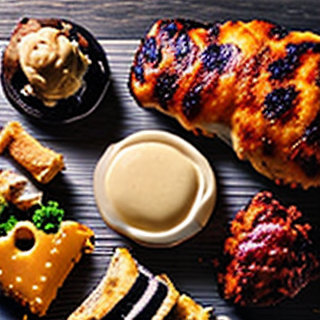

### integration-1787670179055

- Shape: inferred from ingredients
- Ingredients: 2
  - Mozzarella (Medium)
  - Bacon (Large)
- ProfitFactor: 0.58
- Texture: embedded base64 PNG (44712 chars)

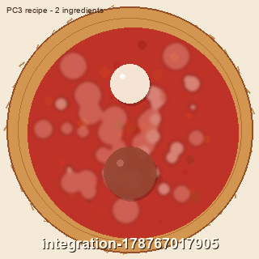

### integration-1787670325169

- Shape: inferred from ingredients
- Ingredients: 2
  - Mozzarella (Large)
  - Tomato (Small)
- ProfitFactor: 0.6
- Texture: embedded base64 PNG (46236 chars)

### integration-1787670887152

- Shape: inferred from ingredients
- Ingredients: 2
  - Mozzarella (Medium)
  - Tomato (Small)
- ProfitFactor: 0.75
- Texture: embedded base64 PNG (45748 chars)

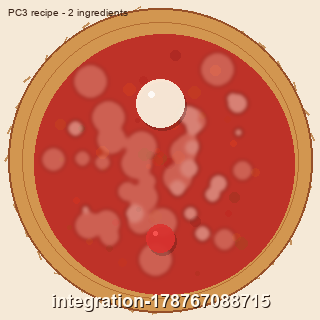

### integration-1787670944977

- Shape: inferred from ingredients
- Ingredients: 2
  - Mozzarella (Large)
  - Bacon (Large)
- ProfitFactor: 0.82
- Texture: embedded base64 PNG (44516 chars)

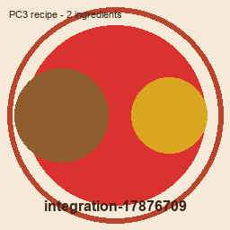

### integration-1787671240458

- Shape: inferred from ingredients
- Ingredients: 2
  - Bacon (Medium)
  - Tomato (Small)
- ProfitFactor: 1.85
- Texture: embedded base64 PNG (45240 chars)

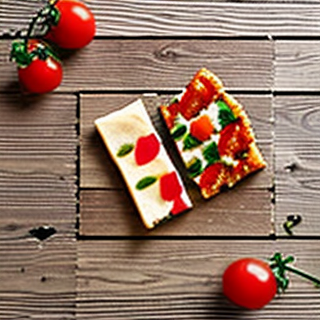

### integration-1787671265622

- Shape: inferred from ingredients
- Ingredients: 2
  - Bacon (Large)
  - Mozzarella (Medium)
- ProfitFactor: 0.72
- Texture: embedded base64 PNG (44768 chars)

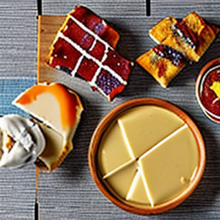

### integration-1787671289085

- Shape: inferred from ingredients
- Ingredients: 2
  - Mozzarella (Large)
  - Bacon (Medium)
- ProfitFactor: 0.65
- Texture: embedded base64 PNG (45576 chars)

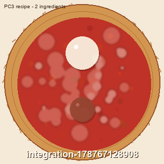

### integration-1787671313617

- Shape: inferred from ingredients
- Ingredients: 3
  - Mozzarella (Medium)
  - Bacon (Medium)
  - Tomato (Medium)
- ProfitFactor: 0.78
- Texture: embedded base64 PNG (44564 chars)

### integration-1787671335647

- Shape: inferred from ingredients
- Ingredients: 2
  - Mozzarella (Large)
  - Bacon (Large)
- ProfitFactor: 1.8
- Texture: embedded base64 PNG (44688 chars)

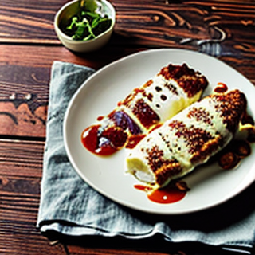

### integration-1787670184236

- Shape: inferred from ingredients
- Ingredients: 2
  - Bacon (Large)
  - Tomato (Medium)
- ProfitFactor: 0.72
- Texture: embedded base64 PNG (45320 chars)

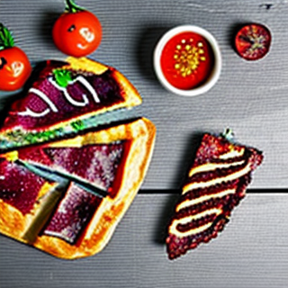

### integration-1787670335274

- Shape: inferred from ingredients
- Ingredients: 3
  - Mozzarella (Large)
  - Bacon (Medium)
  - Tomato (Small)
- ProfitFactor: 0.75
- Texture: embedded base64 PNG (45700 chars)

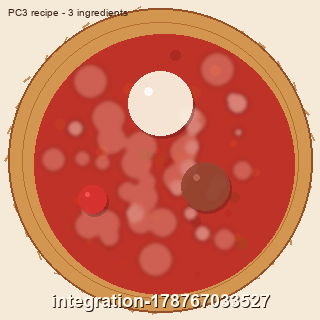

### integration-1787670897677

- Shape: inferred from ingredients
- Ingredients: 3
  - Mozzarella (Large)
  - Chicken (Medium)
  - Tomato (Small)
- ProfitFactor: 1.45
- Texture: embedded base64 PNG (45440 chars)

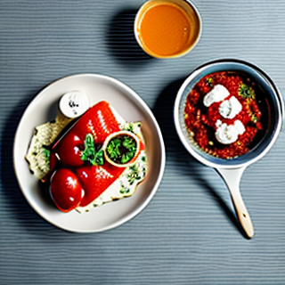

### integration-1787670956814

- Shape: inferred from ingredients
- Ingredients: 3
  - Mozzarella (Medium)
  - Bacon (Large)
  - Tomato (Medium)
- ProfitFactor: 0.75
- Texture: embedded base64 PNG (45020 chars)

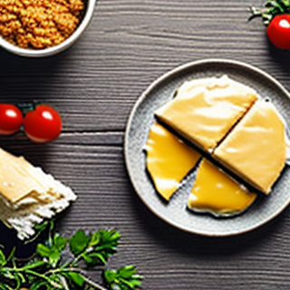

### integration-1787671248343

- Shape: inferred from ingredients
- Ingredients: 3
  - Mozzarella (Large)
  - Chicken (Medium)
  - Tomato (Small)
- ProfitFactor: 0.72
- Texture: embedded base64 PNG (45164 chars)

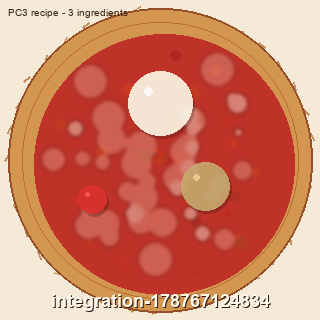

### integration-1787671272816

- Shape: inferred from ingredients
- Ingredients: 3
  - Mozzarella (Medium)
  - Bacon (Medium)
  - Tomato (Large)
- ProfitFactor: 0.72
- Texture: embedded base64 PNG (44656 chars)

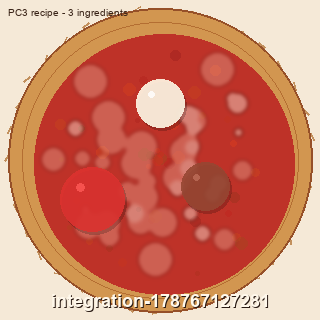

### integration-1787671297078

- Shape: inferred from ingredients
- Ingredients: 2
  - Bacon (Medium)
  - Tomato (Medium)
- ProfitFactor: 0.6
- Texture: embedded base64 PNG (45140 chars)

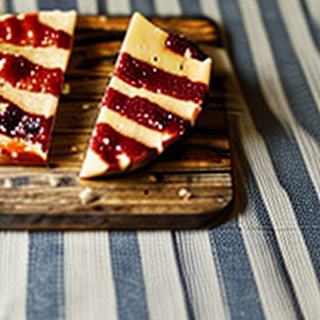

### integration-1787671319245

- Shape: inferred from ingredients
- Ingredients: 2
  - Mozzarella (Large)
  - Bacon (Medium)
- ProfitFactor: 0.52
- Texture: embedded base64 PNG (45508 chars)

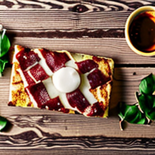

### HawaiianTest-1787675789401

- Shape: inferred from ingredients
- Ingredients: 3
  - Mozzarella (Large)
  - Bacon (Medium)
  - Tomato (Small)
- ProfitFactor: 0.6
- Texture: embedded base64 PNG (45364 chars)

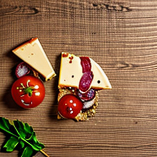

### integration-1787670172913

- Shape: inferred from ingredients
- Ingredients: 2
  - Mozzarella (Medium)
  - Tomato (Small)
- ProfitFactor: 0.7
- Texture: embedded base64 PNG (45692 chars)

### integration-1787670316262

- Shape: inferred from ingredients
- Ingredients: 2
  - Mozzarella (Medium)
  - Tomato (Large)
- ProfitFactor: 0.75
- Texture: embedded base64 PNG (45000 chars)

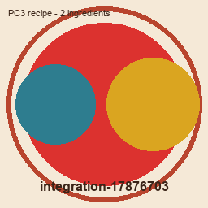

### integration-1787670876961

- Shape: inferred from ingredients
- Ingredients: 2
  - Mozzarella (Large)
  - Tomato (Large)
- ProfitFactor: 0.72
- Texture: embedded base64 PNG (45164 chars)

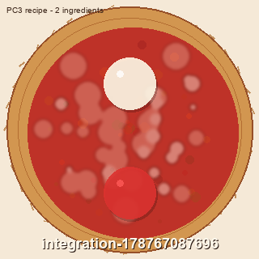

### integration-1787670918592

- Shape: inferred from ingredients
- Ingredients: 2
  - Mozzarella (Medium)
  - Tomato (Medium)
- ProfitFactor: 1.45
- Texture: embedded base64 PNG (45708 chars)

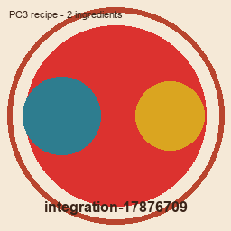

### integration-1787670933744

- Shape: inferred from ingredients
- Ingredients: 2
  - Mozzarella (Medium)
  - Tomato (Large)
- ProfitFactor: 0.82
- Texture: embedded base64 PNG (45036 chars)

### integration-1787671231492

- Shape: inferred from ingredients
- Ingredients: 2
  - Mozzarella (Medium)
  - Tomato (Large)
- ProfitFactor: 0.72
- Texture: embedded base64 PNG (44932 chars)

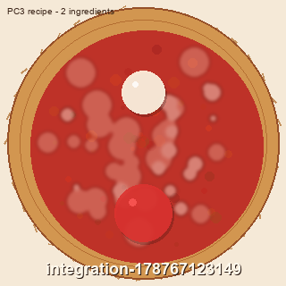

### integration-1787671257093

- Shape: inferred from ingredients
- Ingredients: 2
  - Mozzarella (Large)
  - Tomato (Medium)
- ProfitFactor: 0.42
- Texture: embedded base64 PNG (45804 chars)

### integration-1787671280969

- Shape: inferred from ingredients
- Ingredients: 2
  - Mozzarella (Medium)
  - Tomato (Small)
- ProfitFactor: 0.65
- Texture: embedded base64 PNG (46120 chars)

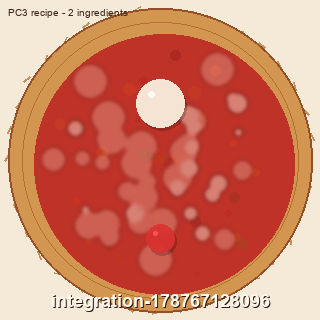

### integration-1787671305934

- Shape: inferred from ingredients
- Ingredients: 2
  - Mozzarella (Large)
  - Tomato (Medium)
- ProfitFactor: 0.72
- Texture: embedded base64 PNG (45808 chars)

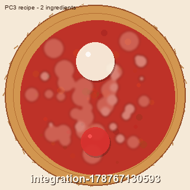

### integration-1787671327955

- Shape: inferred from ingredients
- Ingredients: 2
  - Mozzarella (Medium)
  - Tomato (Large)
- ProfitFactor: 1.85
- Texture: embedded base64 PNG (45216 chars)

### integration-1787674172247

- Shape: inferred from ingredients
- Ingredients: 3
  - Chicken (Large)
  - Tomato (Medium)
  - Mozzarella (Medium)
- ProfitFactor: 1.42
- Texture: embedded base64 PNG (45332 chars)

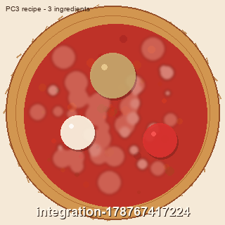

### integration-1787674136447

- Shape: inferred from ingredients
- Ingredients: 2
  - Mozzarella (Large)
  - Tomato (Medium)
- ProfitFactor: 1.8
- Texture: embedded base64 PNG (45184 chars)

### integration-1787674164205

- Shape: inferred from ingredients
- Ingredients: 3
  - Mozzarella (Medium)
  - Bacon (Large)
  - Tomato (Medium)
- ProfitFactor: 0.45
- Texture: embedded base64 PNG (44456 chars)

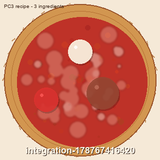

### integration-1787674145299

- Shape: inferred from ingredients
- Ingredients: 2
  - Tomato (Medium)
  - PizzaSauce (Medium)
- ProfitFactor: 1.35
- Texture: embedded base64 PNG (45324 chars)

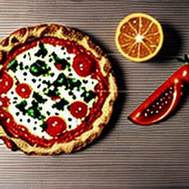

### integration-1787674178294

- Shape: inferred from ingredients
- Ingredients: 3
  - Mozzarella (Large)
  - Bacon (Medium)
  - Tomato (Small)
- ProfitFactor: 1.45
- Texture: embedded base64 PNG (45372 chars)

